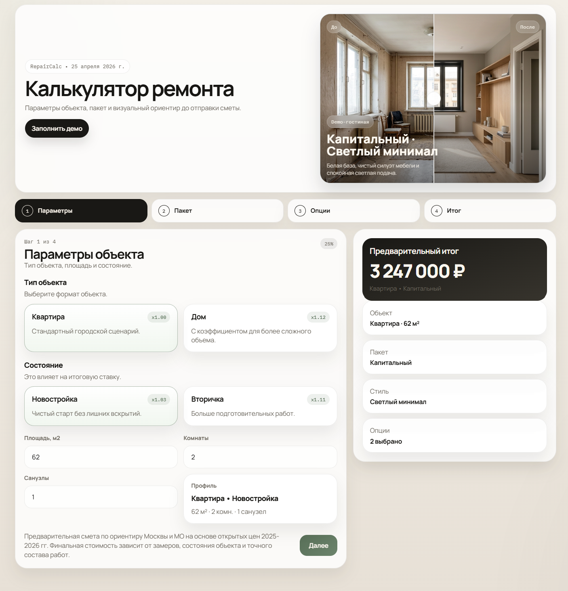
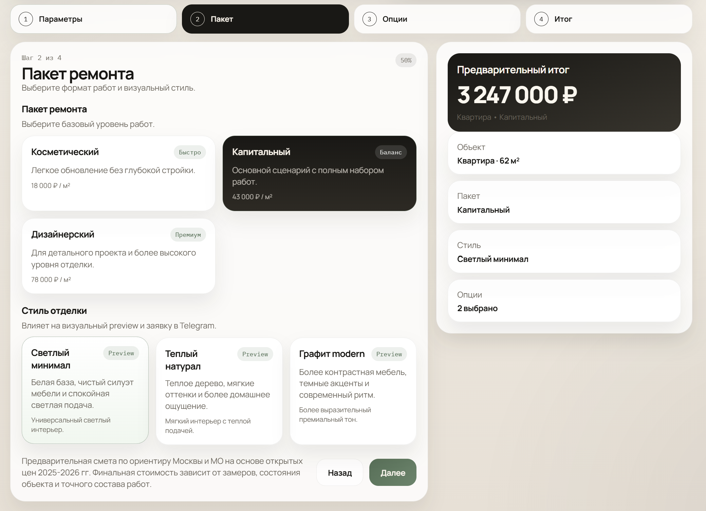
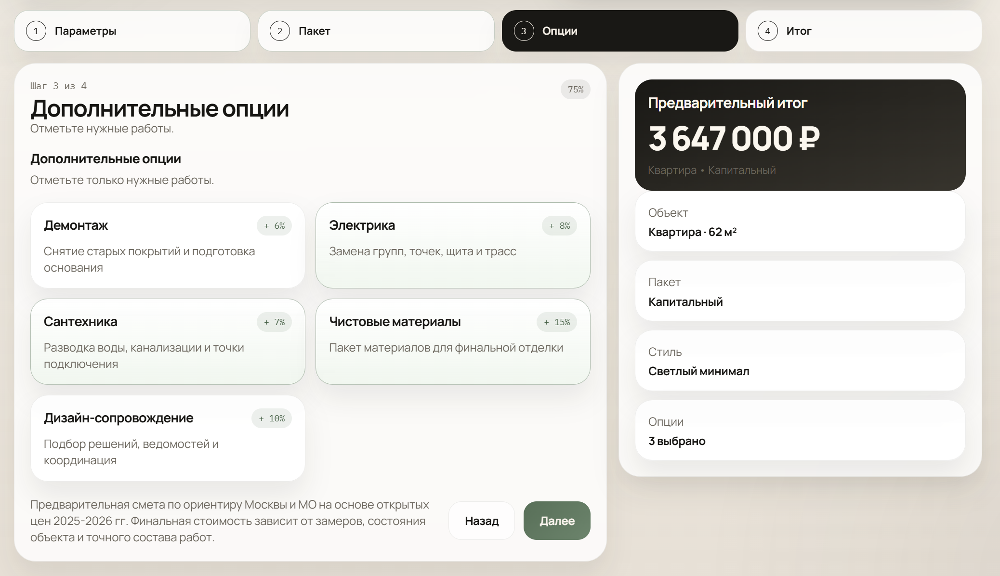
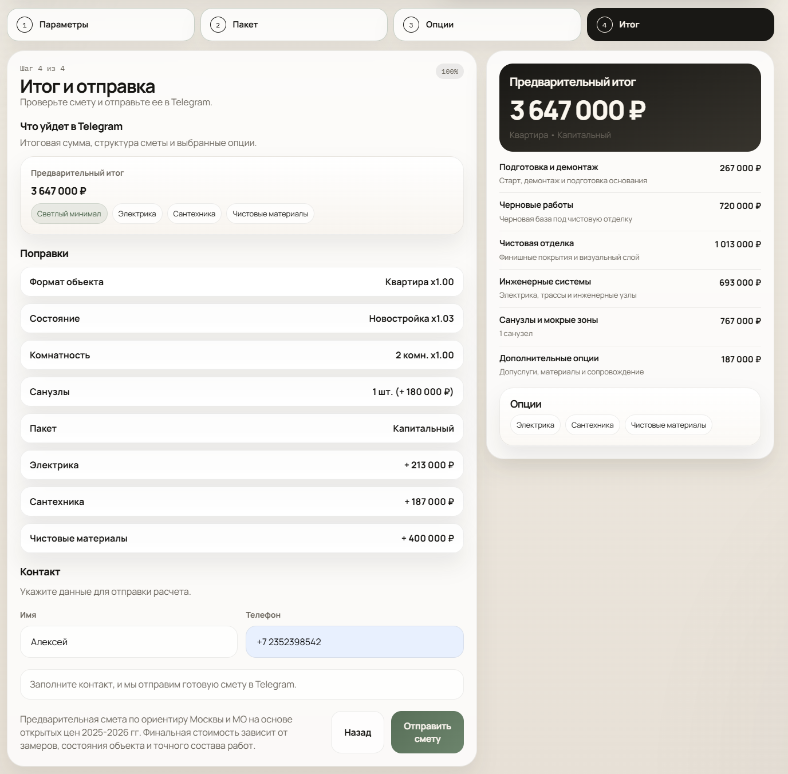
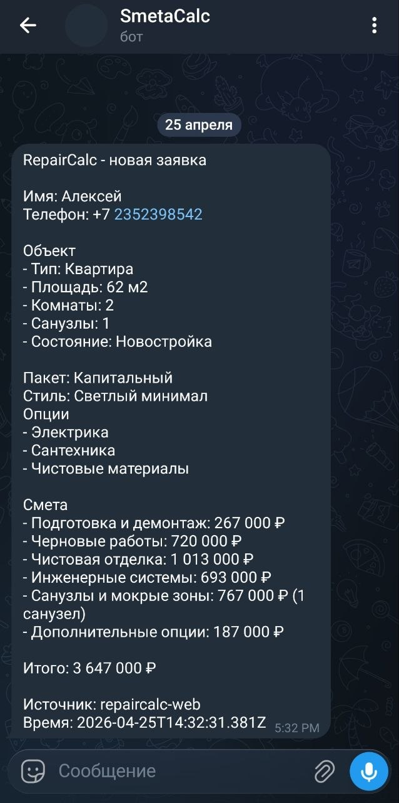

# RepairCalc

Портфолио-MVP калькулятора ремонта: пользователь вводит параметры объекта, выбирает пакет работ и стиль отделки, получает предварительную смету и отправляет заявку в Telegram.



## Demo

[Смотреть видео-демо](docs/assets/repaircalc-demo.mp4)

Короткий сценарий: пользователь открывает калькулятор, выбирает параметры ремонта, видит live-смету и отправляет заявку в Telegram.

## Что показывает проект

- Пошаговый `wizard` на русском языке без перегруженного dashboard-интерфейса.
- Живой расчет сметы по редактируемому demo-прайсу.
- Before/after preview комнаты на локальных demo-render изображениях.
- Telegram lead capture через небольшой Node API.
- Mock-режим без env-переменных, чтобы проект можно было проверить локально.
- Адаптивный интерфейс для desktop и mobile.

## Screenshots

| Пакет и стиль | Опции |
| --- | --- |
|  |  |

| Финальная смета | Telegram-заявка |
| --- | --- |
|  |  |

## Portfolio Assets

- GIF для кейса: `public/portfolio/repaircalc-before-after.gif`
- HTML-showcase для качественной записи/демо: `public/portfolio/before-after-showcase.html`
- Preview-сцены: `public/room-preview`
- Гайд по записи и презентации: `PORTFOLIO_GUIDE.md`
- GitHub media: `docs/assets`

## Стек

- `Vite + React + TypeScript`
- `react-hook-form + zod`
- `Framer Motion`
- `Express`
- `Vitest + Testing Library`

## Быстрый запуск

```bash
npm install
npm run dev
```

Приложение: `http://localhost:5173`  
API: `http://localhost:8787/api/health`

## Как быстро проверить

1. Откройте `http://localhost:5173`.
2. Нажмите `Заполнить демо`.
3. Проверьте итоговую смету и контакт на финальном шаге.
4. Нажмите `Отправить смету`.
5. Если Telegram env не заполнены, заявка появится в mock-логе backend.

## Telegram

Создайте `.env` по примеру `.env.example`:

```env
TELEGRAM_BOT_TOKEN=your_bot_token
TELEGRAM_TARGET_CHAT_ID=your_numeric_chat_id
```

Важно: Telegram username вроде `@ThorBakiN` не равен numeric `chat_id`. Для реальной отправки пользователь должен открыть диалог с ботом, после чего нужно получить numeric `chat_id`.

Если переменные не заданы, endpoint `POST /api/estimate/send` работает в mock-режиме и пишет сообщение в консоль.

## Проверки

```bash
npm run lint
npm run test
npm run build
```

## Структура

- `src/features/repair-calculator` - UI, шаги формы и логика калькулятора.
- `src/shared/config/pricing.json` - demo-прайс и коэффициенты.
- `src/shared/config/visual-preview.ts` - mapping preview-сцен.
- `public/room-preview` - публичные изображения для before/after preview.
- `server` - локальный API и Telegram-интеграция.
- `PROJECT_CONTEXT.md` - продуктовый и технический контекст.
- `PROJECT_PLAN.md` - этапный план.
- `System.md` - правила работы и quality bar.

## Ограничения MVP

- Цены демонстрационные и не являются коммерческим прайсом подрядчика.
- Preview показывает визуальный ориентир, а не персональный дизайн-проект.
- Лиды хранятся только в Telegram, без CRM/БД/Google Sheets.
- Проект ориентирован на локальную демонстрацию, но backend можно вынести в serverless/API-hosting.
